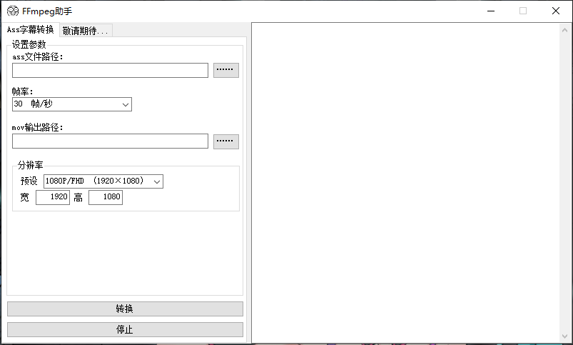

# Ffmpeg_With_Shell

给ffmpeg加了个shell  

特别感谢  [**大fa师（CHFreezer）**](https://github.com/0x3f3f3f3f") 改进代码  

## 主要功能
将ass字幕转为mov视频并输出  

## 更新日志  

**2020-02-11**  

1. 修复无法找到subtitles参数的bug  
2. 初步完成ass转mov功能  
3. 改进多线程代码  

**2020-02-11**

1. 输出窗口添加纵向滚动条  
2. 增加输出分辨率设置项  

**2020-02-12**

1. 新增帧率和分辨率的预设功能  
2. 自动识别ass文件结束时间  
3. process线程改为async  
4. 以上3项功能由 [**大fa师（CHFreezer）**](https://github.com/0x3f3f3f3f") 实现  

---
## 软件界面

